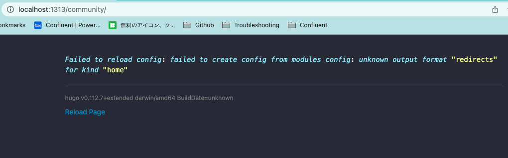

## Reference
blog Repo：　https://github.com/confluent-jp/blog-repo

オリジナルRepo: https://github.com/wowchemy/starter-hugo-academic

サンプル: https://academic-demo.netlify.app/

## How
```bash
brew install hugo
git clone https://github.com/confluent-jp/blog-repo.git
cd blog-repo
hugo server
```
http://localhost:1313/community/ にアクセス。

## User
```content/author``` 配下にユーザーIDによるフォルダを作成の上、```index.md```を配置。併せて画像ををavatar.png (avatar.jpg) という名前で設置するとポートレイトも足せます。 (是非登録してください。)

## Blog
```content/blog``` 配下にフォルダとして登録。
- フォルダ名は自由ながら、このままURLの一部となります。SEO的にもなるべく具体的な文言を含めてください。
- author - ご自身のuser IDを指定してください。
- date - 未来日付を入れておくとその日に公開されます。
- lastmod - 登録時の自動更新等は無いです。更新時は面倒ですが毎回```lastmod```の更新をお願いします。
- category - 厳密なリストではありませんが、以下の中から該当を記載してください。あまり増やすものでもありませんが、足していただいても結構です。
    - type - Blog or Announcement or Note (ショート)
    - area - KIP, Kafka Core, Kafka Connect, KSQL, Flink, Schema Registry, Confluent for Kubernetes, etc.
- tag - categoryよりは自由に足してください。
- ブログに関する画像を何か、featured.png (featured.jpg) という名前で同じフォルダに保存してください。プレビューとブログ本文と、それぞれ自動的にリサイズされたものが表示されます。
- 追加画像その他の利用方法はサンプルを参照してください。

## Note
### hugo server error

```hugo server``` でローカルサーバ起動時にエラーが発生する場合は以下の手順を実行：
1. ```config.yaml```の該当セクション (```output.home```)の配列から```WebAppManifest```、```headers```、```redirects```を一旦抜いて保存。
2. 以下のコマンドを実行してhugoモジュールの再構築
    
    ```bash
    hugo mod clean
    hugo mod get -u ./...
    hugo mod tidy
    ```
3. config.yamlを元に戻して保存。その後```hugo server```を再実行。
参考：[failed to resolve output format "headers" from site config の対処](https://zenn.dev/meihei/articles/32bb275f71e938)


